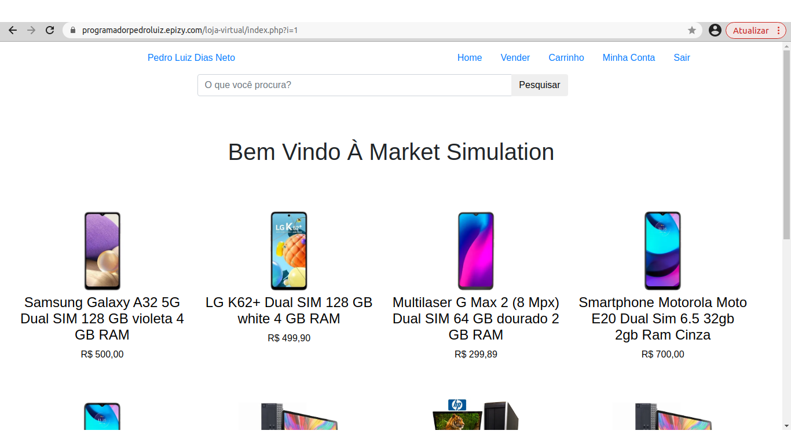

<h1 align="center">Loja Virtual - Market Simulation</h1>

<h2 align="center">
  Link da projeto funcionando:
  <a target="_blank" href="https://programadorpedroluiz.epizy.com/loja-virtual/index.php">
    https://programadorpedroluiz.epizy.com/loja-virtual/index.php
  </a>
</h2>

  Esse é o meu projeto pessoal (<a href="https://www.linkedin.com/in/pedro-luiz-dias-neto-943539252/">Pedro Luiz - LinkedIn</a>)
  onde estou colocando todas as habilidades, tecnologias, linguagens, etc, que estou aprendendo como desenvolvedor Back-End PHP.
  Se trata de uma simulação de loja virtual, onde você pode tanto comprar, como vender seus próprios produtos. 

<h2>
  Funcionalidades já Existentes:
</h2>
<ul>
  <li>Você pode criar uma <a href="https://programadorpedroluiz.epizy.com/loja-virtual/criar-conta.php">nova conta de usuário;</a></li>
  <li>Você pode <a href="https://programadorpedroluiz.epizy.com/loja-virtual/login.php">entrar na sua conta</a> já existente;</li>
  <li>Você pode comprar os produtos que desejar;</li>
  <li>Você pode adicionar os produtos no seu carrinho de compras;</li>
  <li>Você pode pesquisar por produtos que você deseja encontrar;</li>
  <li>Você pode <a target="_blank" href="https://programadorpedroluiz.epizy.com/loja-virtual/account.php?link=vender">
      colocar seus próprios produtos à venda</a> (desde que já tenha criado sua própria conta);</li>
</ul>

<h2>Funcionalidade à Serem Implementadas:</h2>
<ul>
  <li>Simulação de sistema de pagamento através da API Stripe;</li>
  <li></li>
</ul>
